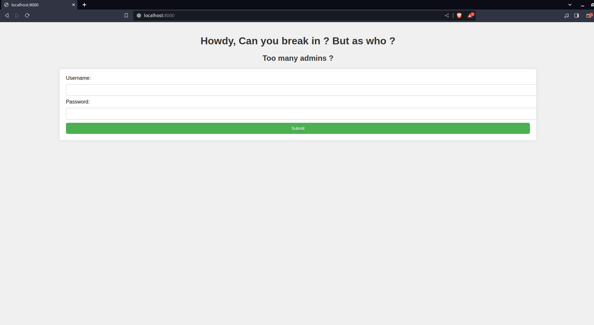
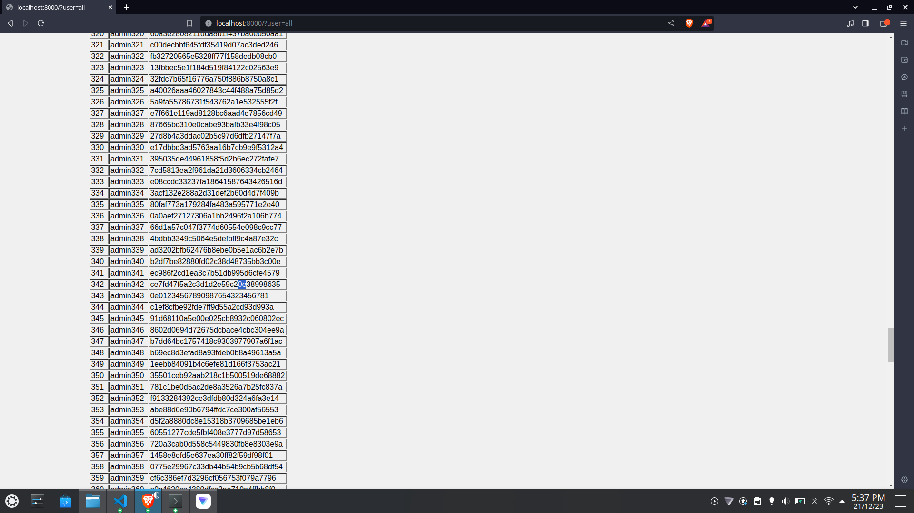
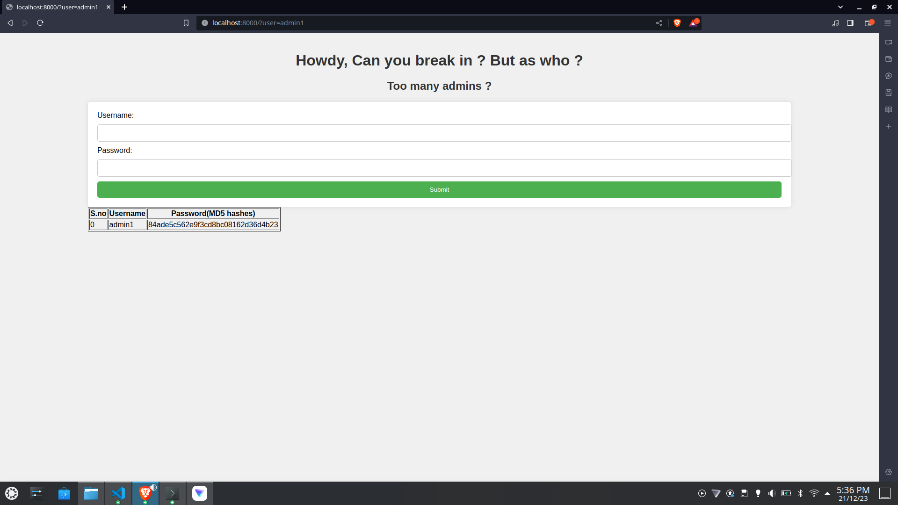
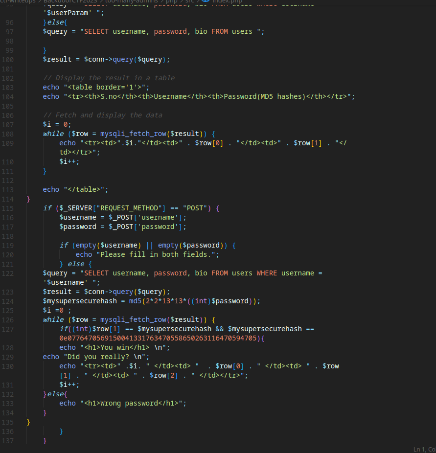

# Too-many-admins

## Description 

Too many admins spoil the broth. Can you login as the right admin and get the flag?

Author - p1r4t3 aka me 

## Writeup
1. On launching the challenge we land at the homepage with two fields username and password, a classic authentication bypass



2. On reading the source provided we can easily see to dump the details of all users we need to visit http://localhost:8000/?user=all



3. On looking through dump.sql we find that we need to login as some user and his bio will contain the flag.



4. On going through the source we find that we need to first find a number which on getting multiplied by 676 will yield a number whose md5 hash will satisfy all the comparisons. On reading the source we find that the generated hash should be equal to a bizzare hash given in the source. But is it really the case ?



5. On reading about php comparison operations we find the <a href="https://github.com/swisskyrepo/PayloadsAllTheThings/blob/master/Type%20Juggling/README.md">typejuggling</a> vulnerability. We find the number should be "355933".

6. Now we need to find the right admin which can be easily found by bruteforcing the cred for those admins whose password hash begins with "0e"

```bash
flag{1m40_php_15_84d_47_d1ff323n71471n9_7yp35}
```